<div align="center">

# 📡 News Radar

**Your personal AI-powered news radar. Fetch, score, and summarize daily briefings from RSS, Hacker News, and Reddit.**

[](LICENSE)
[](https://python.org)
[](https://github.com/astral-sh/uv)
[](https://harshads-git.github.io/news-radar/)
[](http://makeapullrequest.com)


📡 Built in 30 days, 1 hour/day. An AI pipeline that turns internet noise into a curated daily reading list.

[📖 Live Demo](https://harshads-git.github.io/news-radar/) · [⚙️ Configuration Guide](#configuration) · [🚀 Quick Start](#quick-start)

</div>

---

## ✨ What Is This?

Good news is scattered; bad news is endless. **News Radar** gives you a personal first pass over Hacker News, Reddit, and RSS feeds: it **fetches, deduplicates, scores, filters, and enriches** stories with AI-generated summaries and background context — then delivers them as a clean daily briefing on GitHub Pages, email, or Discord.

---

## 🏗️ Architecture

```mermaid
%%{init: {
  "theme": "base",
  "themeVariables": {
    "fontFamily": "ui-sans-serif, system-ui, sans-serif",
    "fontSize": "16px",
    "primaryTextColor": "#1e1e2e",
    "primaryBorderColor": "#6c7086",
    "lineColor": "#89b4fa",
    "tertiaryColor": "#1e1e2e",
    "clusterBkg": "#181825",
    "clusterBorder": "#313244"
  }
}}%%
flowchart LR
    classDef config fill:#f38ba8,stroke:#e64553,color:#1e1e2e,stroke-width:2px;
    classDef source fill:#cba6f7,stroke:#9b59b6,color:#1e1e2e,stroke-width:1.5px;
    classDef process fill:#fab387,stroke:#e08060,color:#1e1e2e,stroke-width:1.5px;
    classDef output fill:#a6e3a1,stroke:#40a02b,color:#1e1e2e,stroke-width:1.5px;

    config["⚙️ Config\nsources.json + .env"]:::config

    subgraph sources["📡 Configured Sources"]
        rss["RSS Feeds"]:::source
        hn["Hacker News"]:::source
        reddit["Reddit"]:::source
    end

    fetch["📥 Fetch\nhttpx + feedparser"]:::process
    dedup["🔗 Deduplicate\nURL + Jaccard similarity"]:::process
    score["🤖 AI Score\n0–10 with reason"]:::process
    summarize["📝 AI Summarize\n+ web context"]:::process
    store["💾 Store\ndata/briefings/"]:::process

    subgraph outputs["📤 Outputs"]
        pages["🌐 GitHub Pages\ndaily briefing site"]:::output
        email["📧 Email\nSMTP delivery"]:::output
        webhook["🔔 Discord / Slack\nwebhook push"]:::output
    end

    config --> sources
    sources --> fetch
    fetch --> dedup
    dedup --> score
    score --> summarize
    summarize --> store
    store --> outputs
```



---

## 🚀 Features

| Feature | Description |
|---------|-------------|
| 📡 **Multi-Source Fetching** | RSS, Hacker News API, Reddit JSON — all in one pipeline |
| 🤖 **AI Scoring** | Every item scored 0–10 by GPT-4o-mini, Gemini, or Claude |
| 🔗 **Smart Deduplication** | URL normalization + Jaccard title similarity removes cross-platform reposts |
| 📝 **Context-Aware Summaries** | DuckDuckGo web search adds background context before summarizing |
| 💾 **JSON Persistence** | Dated briefings stored locally as `data/briefings/YYYY-MM-DD.json` |
| 🌐 **GitHub Pages Site** | Auto-published daily briefing website (no Jekyll, pure HTML) |
| 📧 **Email Delivery** | Self-hosted SMTP briefing delivery (Gmail App Password supported) |
| 🔔 **Webhook Notifications** | Discord, Slack, or custom webhook digest of top 5 items |
| ⚙️ **Config-Driven** | Everything tunable via `sources.json` + `.env` — no code changes needed |
| 🐳 **Docker Ready** | Multi-stage Dockerfile + `docker-compose.yml` for reproducible runs |

---

## 🏁 Quick Start

### Prerequisites

- Python 3.11+
- [`uv`](https://github.com/astral-sh/uv) package manager
- An OpenAI, Gemini, or Anthropic API key

### Installation

```bash
# 1. Clone the repo
git clone https://github.com/Harshads-git/news-radar.git
cd news-radar

# 2. Install dependencies
uv sync --extra dev

# 3. Set up environment
cp .env.example .env
# Edit .env with your API key

# 4. Run the setup wizard
uv run python -m src.main --setup

# 5. Run your first briefing
uv run python -m src.main --run
```

---

## ⚙️ Configuration

All configuration is done through two files:

### `.env` — Secrets & Runtime Settings

```bash
# Choose your AI model
AI_MODEL=gpt-4o-mini          # or gemini-1.5-flash, claude-3-haiku-20240307

# Score threshold (0–10): items below this are filtered out
SCORE_THRESHOLD=6

# Output language
OUTPUT_LANGUAGE=English
```

See [`.env.example`](.env.example) for all available options.

### `data/sources.json` — What to Watch

```json
{
  "sources": [
    { "type": "rss", "name": "Hacker News", "url": "https://hnrss.org/frontpage" },
    { "type": "hackernews", "name": "HN Top Stories", "limit": 30 },
    { "type": "reddit", "name": "r/programming", "subreddit": "programming", "limit": 25 }
  ]
}
```

---

## 📁 Project Structure

```
news-radar/
├── src/                    # Main source package
│   ├── main.py             # CLI entry point (--run, --setup, --dry-run)
│   ├── config.py           # Pydantic BaseSettings config loader
│   ├── models.py           # Core data models (NewsItem, ScoredItem, Briefing)
│   ├── orchestrator.py     # Pipeline controller
│   ├── search.py           # DuckDuckGo web context fetcher
│   ├── exceptions.py       # Custom exception hierarchy
│   ├── logger.py           # Rich-powered centralized logger
│   ├── scrapers/           # Data fetchers
│   │   ├── base.py         # Abstract BaseScraper
│   │   ├── rss.py          # RSS/Atom feed scraper
│   │   ├── hackernews.py   # Hacker News API scraper
│   │   └── reddit.py       # Reddit JSON API scraper
│   ├── ai/                 # AI integration layer
│   │   ├── base.py         # Abstract BaseAIProvider
│   │   ├── scorer.py       # 0–10 scoring engine
│   │   └── summarizer.py   # Context-aware summarizer
│   ├── services/           # Output delivery
│   │   ├── markdown_generator.py
│   │   ├── site_generator.py
│   │   ├── email_service.py
│   │   └── webhook_service.py
│   └── storage/            # Persistence
│       ├── briefing_store.py
│       └── cache.py
├── tests/                  # Test suite (pytest + asyncio)
├── scripts/                # Operational scripts
│   └── daily-run.sh        # Shell wrapper for cron runs
├── docs/                   # GitHub Pages site
│   └── assets/             # Screenshots and static assets
├── data/                   # Runtime data (gitignored)
│   ├── briefings/          # Generated YYYY-MM-DD.json files
│   ├── cache/              # AI response cache
│   └── sources.json        # Source configuration
├── .github/
│   └── workflows/
│       ├── daily-run.yml   # Scheduled daily run
│       └── deploy-docs.yml # GitHub Pages deployment
├── .env.example            # Environment template
├── pyproject.toml          # Project config + dependencies
└── Dockerfile              # Multi-stage container build
```

---

## 🤝 Contributing

Contributions are welcome! Please read [CONTRIBUTING.md](CONTRIBUTING.md) first.

---

## 🔒 Security

Never commit your `.env` file or API keys. See [SECURITY.md](SECURITY.md) for best practices.

---

## 📄 License

MIT © [Harshads-git](https://github.com/Harshads-git)

---

<div align="center">

**Built in 30 days · 1 hour/day · Inspired by [Thysrael/Horizon](https://github.com/Thysrael/Horizon)**

</div>
